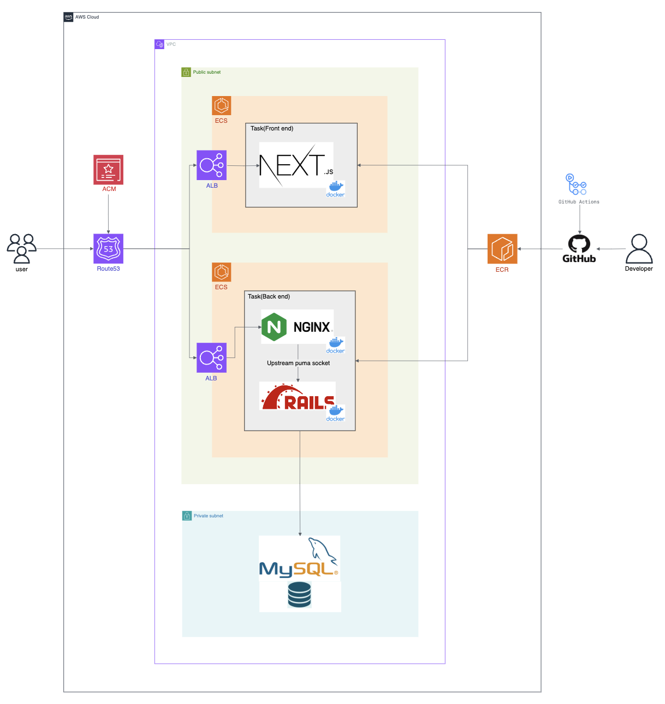
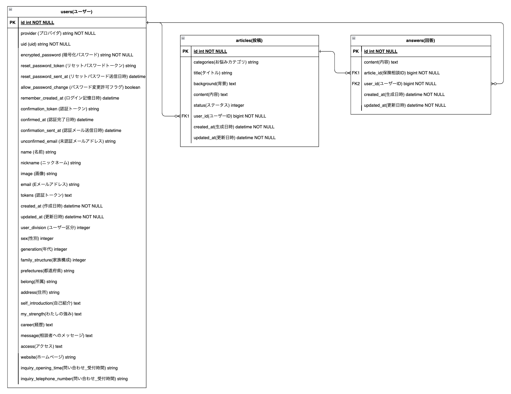

# 保険のセカンドオピニオン
「保険のセカンドオピニオン」は保険契約者が保険に関する疑問を専門家に相談できるWebサービスです。  
https://second-opinion365.com/  
※サインイン画面にてゲストサインインでサービスをお試し頂けます。

## サービス概要・制作背景
### サービスの流れ
1. 相談者・保険契約者が属性情報を入力する。  
　例：性別（男）・年代・家族構成（独身）など  
2. 回答者・保険営業者が属性情報を入力する。  
　例：氏名・所属企業・営業方針・医療保険や貯蓄性など得意な保険分野・問い合わせ先など  
3. 相談者・保険契約者が保険契約に関する疑問を投稿する。  
　例：「本人死亡時の一時給付金3000万円は保険契約者の属性と照らし合わせて妥当でしょうか？」  
4. 回答者・保険営業者（直接の保険営業者担当者以外）が質問に対する回答を投稿する。  
　例：「配偶者や扶養対象の子供がいなければ、一時給付金を見直せる可能性があります。」  

### 背景・テーマ選定理由
保険契約者の属性と保障内容が必ずしも適切に一致していないケースを目にすることがあります。  
特に保険・不動産・投資商品など買い手と売り手で情報の非対称性が大きい分野は、買い手側が十分な判断基準や商品知識を持たない場合、買い手にとって理想的でない契約が発生する可能性があると感じています。

例えば、新卒で企業に入社した際に、企業ごとに提携している保険営業者から保険契約の提案を受けることがあります。  
保険契約者が23歳・未婚・子どもなしという状況では、通常、手厚い保障が必ずしも必要とされないケースが多いものの、死亡一時給付金・三大疾病保険・医療保険を含む月額保険料約3万円の契約を結ぶ例が見受けられます。  
このようなケースは、情報の非対称性が要因の一つとして関係している可能性があり、買い手側が十分な選択肢を理解できる仕組みがあれば、よりバランスの取れた選択ができると考えています。

そこで「保険のセカンドオピニオン」というサービスを通じて、情報の非対称性を緩和して保険契約者が適切な判断を行える環境を提供したいと考えました。  
このサービスは相談者・保険契約者と回答者・保険営業者の双方がメリットを享受できる仕組みを目指します。

相談者・保険契約者は、セカンドオピニオンを通じて契約内容について安心感を得ることができるほか、情報不足を補い適切な意思決定が可能になるメリットがあります。  
一方、回答者・保険営業者は、誠実な回答の積み重ねによって新たな営業チャンネルとして活用が期待できます。

## 機能一覧　
- ユーザー（相談者・保険契約者/回答者・保険営業者）新規登録/ログイン/プロフィール編集
- ユーザー（回答者・保険営業者）・一覧表示
- ユーザー（回答者・保険営業者）・詳細表示
- 簡単ログイン
- 保険相談投稿（相談者・保険契約者の保険契約に関する質問）
- 保険相談投稿・一覧表示
- 保険相談投稿・詳細表示
- 保険相談・回答（回答者・保険営業者の質問に関する回答）
- 保険相談・回答タイムライン表示
- 各種投稿画面における必須入力チェック
- 各種投稿画面における入力文字数カウント
- 各種投稿画面における入力文字数上限チェック

## 使用技術
### フロントエンド
- HTML/CSS
- MUI
- JavaScript
- TypeScript（5.5.2）
- React（18.3.1）
- Next.js（14.2.4）
- Node.js（20.14.0）
- npm（10.7.0）  
**※API通信でバックエンドとの非同期通信によってフロントエンドとバックエンドを完全に分離**

### バックエンド
- Ruby（3.2.3）
- Ruby on Rails（7.0.8.4）
- MySQL（8.0.37）  
**※RESTful APIによってフロントエンドとの疎結合な構成を実現**

### インフラ
- AWS(VPC/EC2/RDS/ALB/ACM/Route53/ECS)
- Nginx/Puma

### CI/CD
- GitHub Actions

### 開発ツール
- Docker
- ESLint
- Prettier
- Rubocop
- RSpec

## インフラ構成図

## ER図

## 課題
- RSpecを活用したテストケースのテスト自動化（機能テストなど実施済）
- Jestを活用したテストケースのテスト自動化（機能テストなど実施済）
- ユーザーの初回利用促進のためランディングページを追加
- スマホやタブレットでのサイト閲覧を想定したレスポンシブ対応
- データ冗長性の削減のためテーブルの正規化
- 相談者・保険契約者から回答者・保険営業者へのダイレクトメッセージ機能の追加
- 「Active Storage」を活用した回答者・保険営業者のプロフィール写真アップロード機能の追加
- インフラ構築の効率化のためTerraformの導入
- Webサイトからのスマホプッシュ通知機能追加などでWebサイト利用頻度向上によるSEO対策
- 保険や投資関連の最新ニュースの発信・閲覧の機能を追加、コンテンツ充実によるWebサイト滞在時間の延伸によるSEO対策
- 他の開発言語学習のためRubyをGoやPHPなど他の開発言語にマイグレーション
