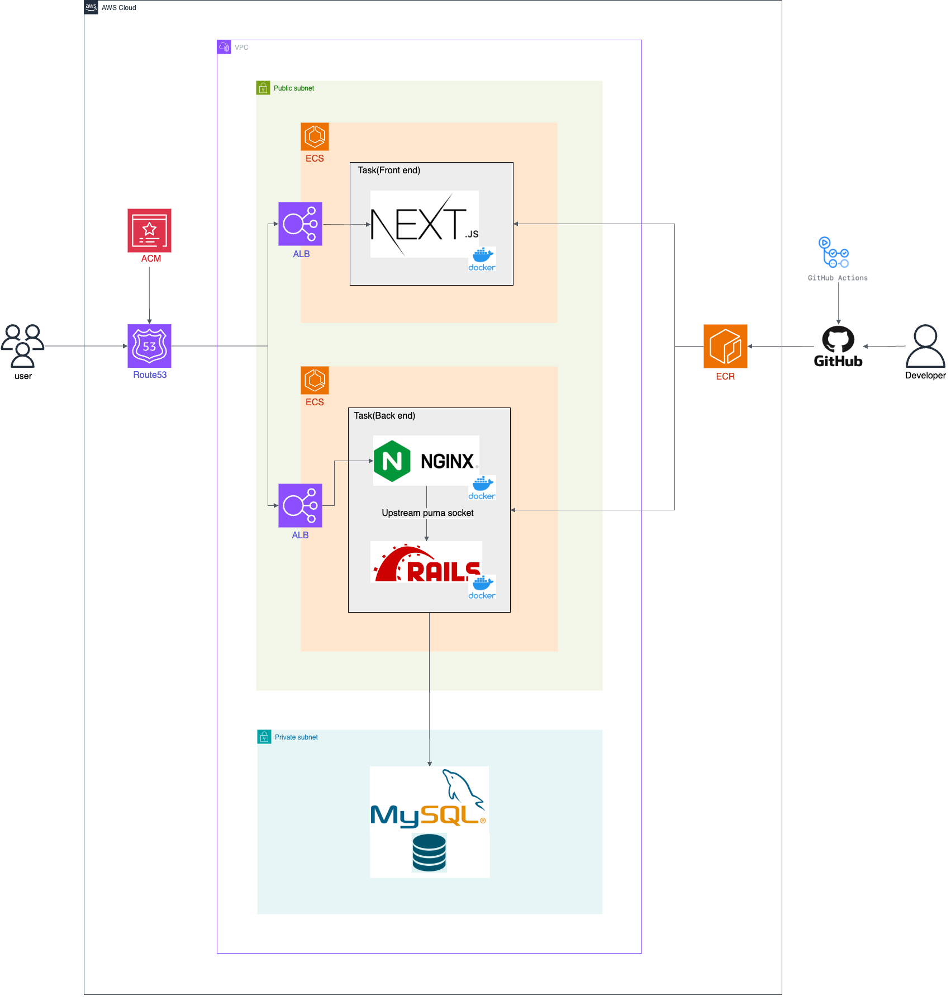

# 保険のセカンドオピニオン

相談者・保険契約者が保険契約に関する疑問を回答者・保険営業者に相談して解決するWebサービスです。
https://second-opinion365.com/

????????

## サービス概要・制作背景

■背景・テーマ選定理由
保険・不動産・投資商品など買い手と売り手の情報非対称性が大きい分野について
サービスの買い手が判断基準や保険商品知識の不足により、買い手に不利で売り手に有利な取引が一定数存在すると感じている。
情報非対称性を解消するため「保険のセカンドオピニオン」というサービスで情報非対称性の解消を図る。
相談者・保険契約者はセカンドオピニオンとして保険契約の相談で情報非対称性を解消するメリット
回答者・保険営業者はいいねを積み上げ権威性の向上、当該サービスを保険営業チャンネルとして活用できるメリットを提供する。

■サービスの流れ
①相談者・保険契約者が属性情報を入力する。
　　例：性別（男）・年代・家族構成（独身）など
②回答者・保険営業者が属性情報を入力する。
　　例：氏名・所属企業・営業方針・医療保険や貯蓄性など得意な保険分野・問い合わせ先など
③相談者・保険契約者が保険契約に関する疑問を投稿する。
　　例：「保険契約者・本人死亡時の一時給付金3000万円は保険契約者の属性と照らし合わせて妥当でしょうか？」など
④回答者・保険営業者（直接の保険営業者担当者以外）が質問に対する回答を投稿する。
　　例：「配偶者や扶養対象の子供がいなければ、属性と保障内容がアンバランス（過剰保障）なので一時給付金は減額すべきです。」など

## 主な機能

## 機能一覧

・簡単ログイン
・ユーザー（相談者・保険契約者/回答者・保険営業者）新規登録/ログイン
・ユーザー情報編集（相談者・保険契約者/回答者・保険営業者）
・ユーザー一覧表示（回答者・保険営業者）
・投稿（相談者・保険契約者の保険契約に関する疑問）
・投稿一覧表示

## 使用技術

◇フロントエンド
・HTML/CSS
・MUI
・JavaScript
・TypeScript（5.5.2）
・React（18.3.1）
・Next.js（14.2.4）
・Node.js（20.14.0）
・npm（10.7.0）

◇バックエンド
・Ruby（3.2.3）
・Ruby on Rails（7.0.8.4）
・MySQL（8.0.37）

◇インフラ
・AWS(VPC/EC2/RDS/ALB/ACM/Route53/ECS)
・Nginx/Puma

◇テスト
・RSpec

◇CI/CD
・GitHub Actions
・Capistrano

◇開発ツール
・ESLint
・Prettier
・Rubocop
・Docker

## インフラ構成図

## ER図

### レベル3

#### レベル4

##### レベル5

- RUby 3.2
